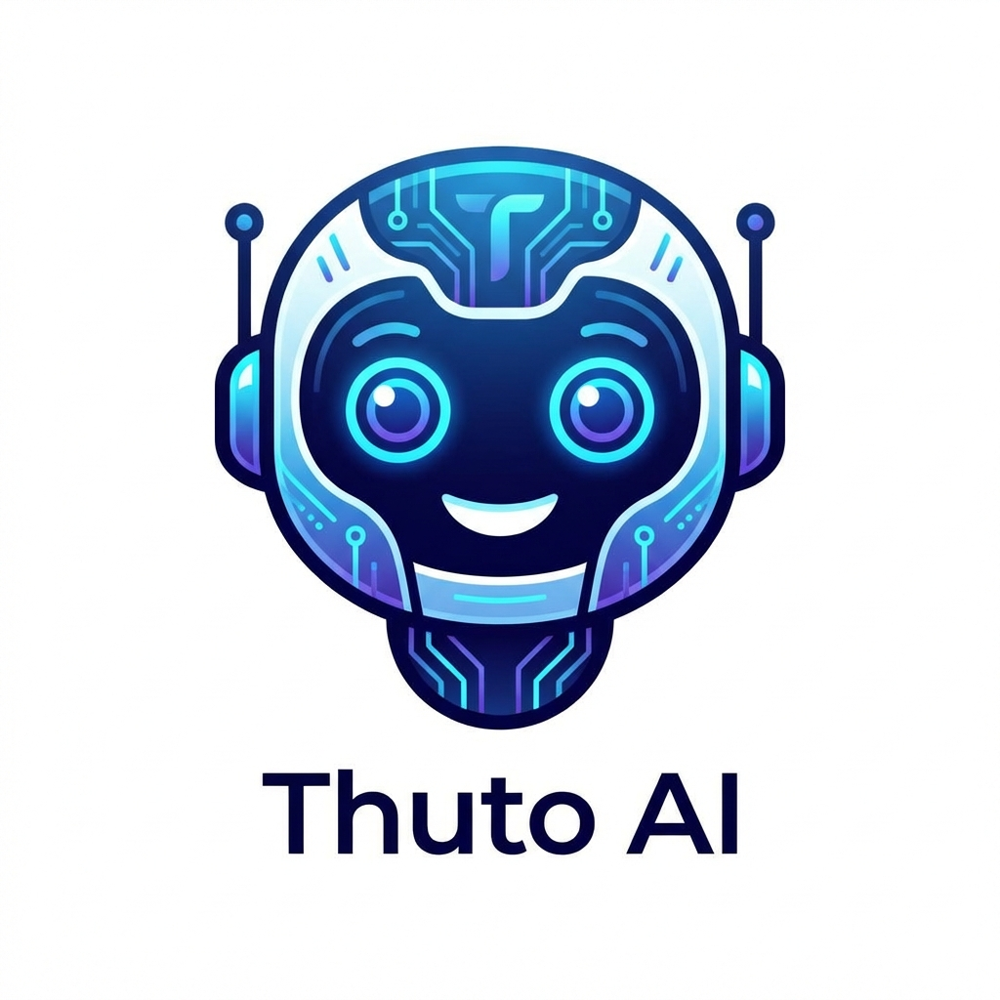
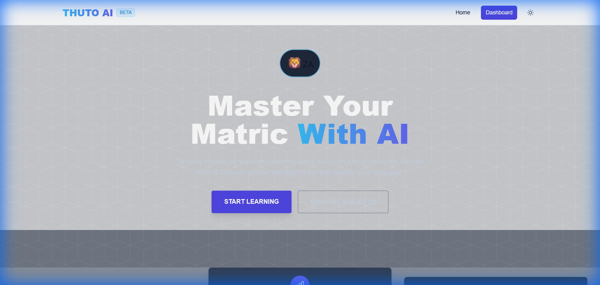
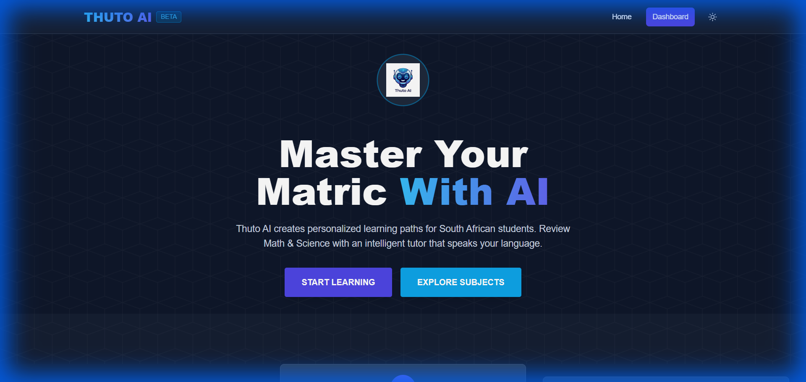
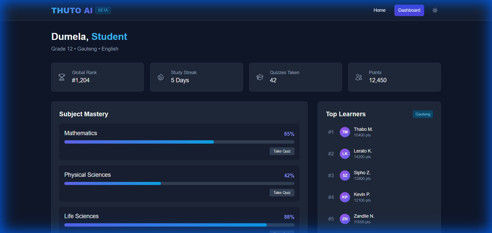
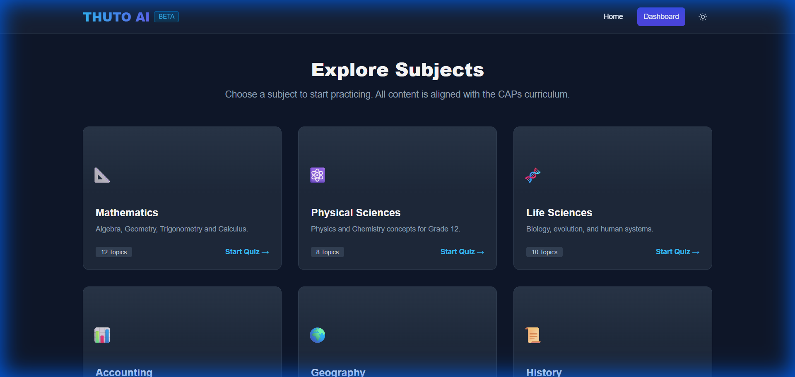
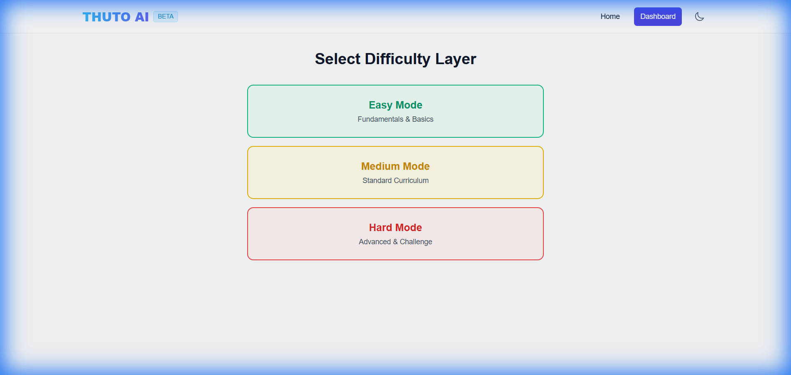
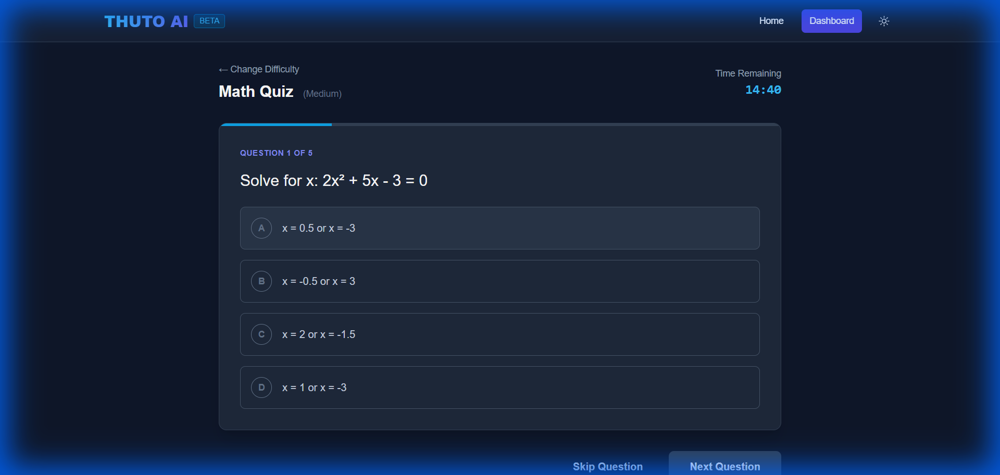
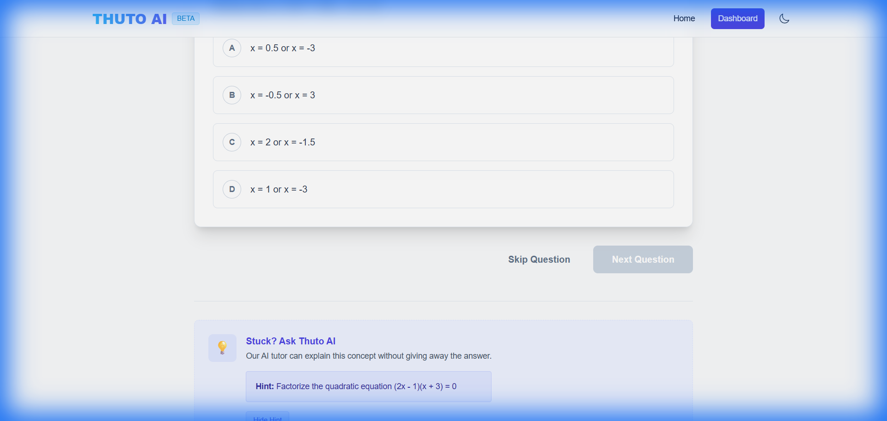
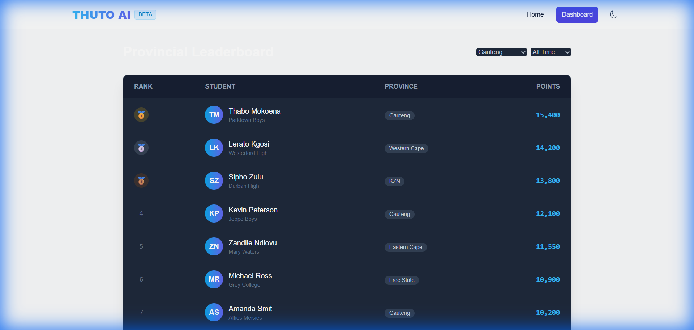

  

<h1 align="center">Thuto AI - Intelligent Matric Assistant</h1>

<strong>Thuto AI</strong> (meaning "Education" in Setswana/Sotho) is a Next-Gen Educational Platform designed to democratize high-quality STEM tutoring for South African students using Artificial Intelligence.

##  The Problem in SA
South Africa faces a critical skills gap in STEM fields, exacerbated by:
- Overcrowded classrooms (1:40+ teacher-student ratio).
- Language barriers in technical subjects.
- Lack of personalized feedback for learners.

## 💡 The AI Solution
Thuto AI uses Large Language Models (LLMs) to:
1.  **Dynamic Curriculum Alignment**: Generate unique, infinite practice problems based on the **CAPS (Curriculum and Assessment Policy Statement)** syllabus.
2.  **Code-Switching Tutor**: Explanation of complex concepts in multiple SA languages (English, Zulu, Xhosa, Sotho) to bridge understanding.
3.  **Adaptive Learning Path**: The AI analyzes student performance to identify "Weak Nodes" (e.g., Euclidean Geometry) and adapts the difficulty automatically.

## 🛠️ Tech Stack (MEVN)
- **Frontend**: Vue.js 3 + Vite + Tailwind CSS
- **Backend**: Node.js + Express
- **Database**: MongoDB (Learner profiles, Progress tracking)
- **AI Engine**: OpenAI/DeepSeek Integration (Simulated for Demo)

## 🚀 Key Features
- **Matric/Grade 12 Focus**: Targeted revision for Finals.
- **Provincial Leaderboards**: Gamified competition between GP, KZN, WC, etc.
- **Micro-Learning**: 5-minute AI quizzes for students with limited data/time.
- **Offline Mode**: Cache AI lessons for study during Load Shedding.

## 📸 App Screenshots

### Light & Dark Mode
| Light Mode | Dark Mode |
|:---:|:---:|
|  |  |

### Interactive Learning Journey
| Dashboard | Subjects |
|:---:|:---:|
|  |  |

### Adaptive Quiz Engine
| Difficulty Selection | Quiz Interface |
|:---:|:---:|
|  |  |

### AI Support & Gamification
| AI Hints | Provincial Leaderboard |
|:---:|:---:|
|  |  |

## 👤 Author
**Koketso Raphasha**
*Advancing Local Solutions with Global Tech.*
