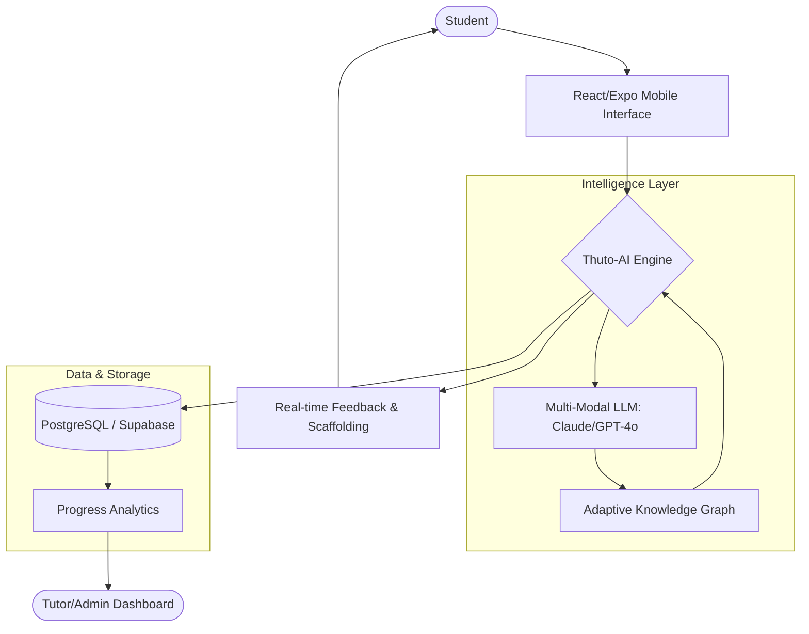

# 🏛️ KIROV DYNAMICS | THUTO AI
### Intelligent Learning for a Sovereign Era

[](https://github.com/Raphasha27)
[](https://github.com/Raphasha27/Health-Hub)
[](https://github.com/Raphasha27/Health-Hub)

---

## 🚀 Overview

**Thuto-AI** is a state-of-the-art intelligent tutoring ecosystem designed to democratize high-end education through artificial intelligence. As a core educational asset of **Kirov Dynamics**, it implements personalized pedagogy and autonomous curricula adaptation to ensure every student reaches their peak potential.

> **"Moving education from static classrooms into dynamic, AI-driven knowledge hubs."**

---

## 🧠 System Architecture: The Sovereign Learner Loop


```mermaid
graph TD
    Student([Student]) --> Interface[React/Expo Mobile Interface]
    Interface --> Core{Thuto-AI Engine}
    
    subgraph Intelligence Layer
        Core --> LLM[Multi-Modal LLM: Claude/GPT-4o]
        LLM --> Graph[Adaptive Knowledge Graph]
        Graph --> Core
    end
    
    subgraph Data & Storage
        Core --> DB[(PostgreSQL / Supabase)]
        DB --> Analytics[Progress Analytics]
    end
    
    Analytics --> Teacher([Tutor/Admin Dashboard])
    Core --> Feedback[Real-time Feedback & Scaffolding]
    Feedback --> Student
```

---

## ✨ Features (v4.0 - Hardened Edition)

- **🧩 Adaptive Knowledge Graphs**: Dynamically maps a student's understanding across subjects, identifying and bridging knowledge gaps in real-time.
- **🎙️ Voice-Enabled Scaffolding**: Natural language interaction for students, powered by high-speed AI voice synthesis.
- **🗺️ Personalized Curricula**: Generates custom lesson plans based on individual performance metrics and learning speed.
- **📱 Cross-Platform Fluidity**: Unified experience across Web (React) and Mobile (Expo/React Native).
- **🛡️ Health Hub Hardening**: 
  - **Zero-Noise CI**: Integrated with the Health Hub v4.0 protocol for silent maintenance.
  - **Success Lock-in**: Automated success state enforcement for all deployments.

---

## 🛠️ Technology Stack

- **Frontend**: React 18, Expo (Mobile), Tailwind CSS (Web)
- **Backend**: Node.js, Express, Supabase (Auth & DB)
- **Intelligence**: LangChain, OpenAI GPT-4o, Claude 3.5 Sonnet
- **Infrastructure**: Vercel (Web), GitHub Actions (Hardened CI/CD)

---

## 📦 Getting Started

**Clone and Install:**
```bash
git clone https://github.com/Raphasha27/thuto-ai
cd thuto-ai
npm install
```

**Launch Development Environment:**
```bash
# For Web
npm start

# For Mobile (Expo)
npx expo start
```

---

© 2026 **Kirov Dynamics Technology** | Developed by **Raphasha27**